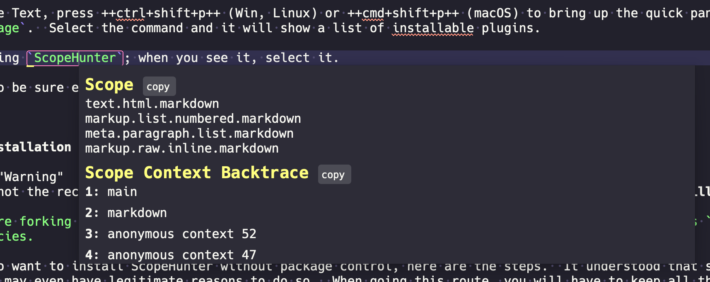
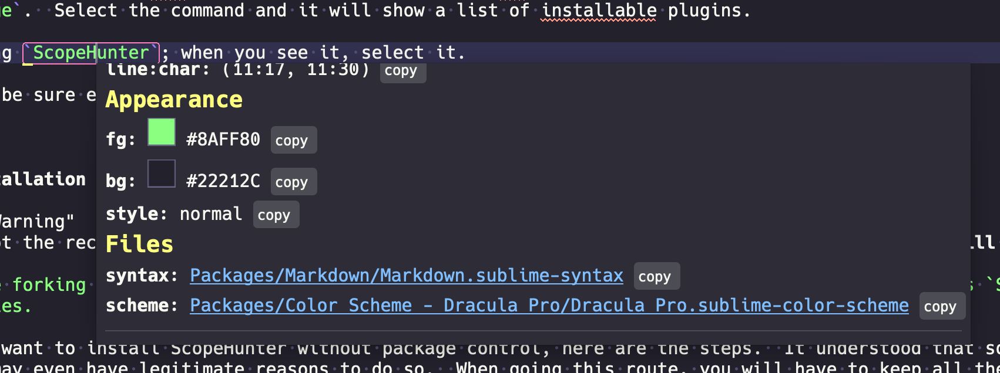

# ScopeHunter

## Overview

This is a simple plugin that can get the scope under the cursor(s) in Sublime Text.  This plugin is useful for plugin
development.

## Features
All features are configurable via the settings file

-   Tooltip output showing scope, context backtrace, scope extent, color values, links to current syntax and relevant
    color schemes.
-   Customizable to show only the information you care about.
-   Auto copy scope to clipboard on execution.
-   Quick copy any or all information to the clipboard.
-   Toggle instant scoping to keep showing scope as you move around a file.
-   Supports [SubNotify][subnotify] messages.

--8<-- "refs.txt"
