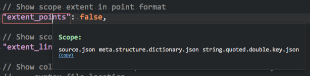

[![Unix Build Status][travis-image]][travis-link]
[![Package Control Downloads][pc-image]][pc-link]
![License][license-image]
# ScopeHunter
This is a simple plugin that can get the scope under the cursor(s) in Sublime Text.  This plugin is useful for plugin development.

Dark theme with simple output:

Light theme with advanced output:

# Features
All features are configurable via the settings file

- Optionally show output in tooltip (stylesheets are configurable).
- Optionally auto choose dark or light tooltip theme depending on your color scheme.
- Optionally dump output to auto-popup panel and/or console.
- Optionally dump scope to status bar (no multi-select support).
- Multi-select support for all output except status bar.
- Optionally log scope extent in line/char format and/or point format.
- Optionally copy scope(s) to clipboard.
- Optionally highlight and/or log scope extent.
- Optionally log color scheme colors and selectors.
- Optionally log location of Scheme file and Syntax.
- Supports [SubNotify](https://github.com/facelessuser/SubNotify) messages.

# Documentation
http://facelessuser.github.io/ScopeHunter/

# License
Scope Hunter is released under the MIT license.

Copyright (c) 2012 - 2018 Isaac Muse <isaacmuse@gmail.com>

Permission is hereby granted, free of charge, to any person obtaining a copy of this software and associated documentation files (the "Software"), to deal in the Software without restriction, including without limitation the rights to use, copy, modify, merge, publish, distribute, sublicense, and/or sell copies of the Software, and to permit persons to whom the Software is furnished to do so, subject to the following conditions:

The above copyright notice and this permission notice shall be included in all copies or substantial portions of the Software.

THE SOFTWARE IS PROVIDED "AS IS", WITHOUT WARRANTY OF ANY KIND, EXPRESS OR IMPLIED, INCLUDING BUT NOT LIMITED TO THE WARRANTIES OF MERCHANTABILITY, FITNESS FOR A PARTICULAR PURPOSE AND NONINFRINGEMENT. IN NO EVENT SHALL THE AUTHORS OR COPYRIGHT HOLDERS BE LIABLE FOR ANY CLAIM, DAMAGES OR OTHER LIABILITY, WHETHER IN AN ACTION OF CONTRACT, TORT OR OTHERWISE, ARISING FROM, OUT OF OR IN CONNECTION WITH THE SOFTWARE OR THE USE OR OTHER DEALINGS IN THE SOFTWARE.

[travis-image]: https://img.shields.io/travis/facelessuser/ScopeHunter/master.svg
[travis-link]: https://travis-ci.org/facelessuser/ScopeHunter
[pc-image]: https://img.shields.io/packagecontrol/dt/ScopeHunter.svg
[pc-link]: https://packagecontrol.io/packages/ScopeHunter
[license-image]: https://img.shields.io/badge/license-MIT-blue.svg
